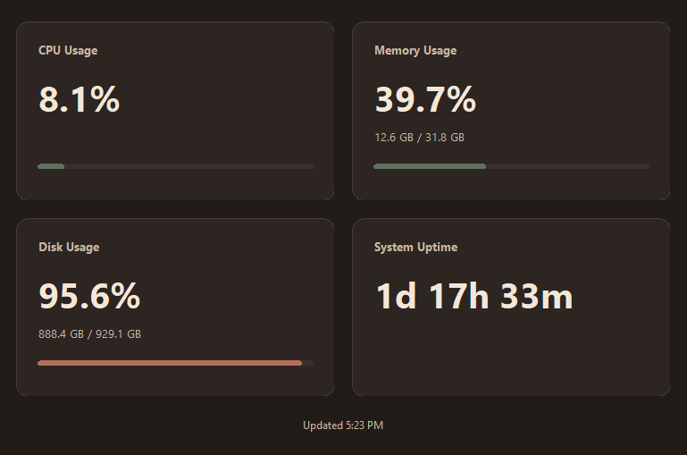

# PC System Dashboard

A lightweight Windows desktop application for monitoring live CPU, memory, disk, and system uptime metrics.



## Features

### Implemented

* Live CPU utilization
* Live memory utilization and capacity
* Primary Windows system-drive usage
* System uptime
* Automatic one-second refresh
* Graceful fallback when individual metrics cannot be read
* Visual utilization progress bars
* Warm dark-walnut desktop interface
* Windows executable packaging with PyInstaller

### Future Ideas

* GPU utilization and temperature monitoring
* Historical metric graphs
* Configurable warning thresholds
* Additional system information
* Per-process monitoring

These are possible future additions and are not part of v1.0.

## Why I Built It

PC System Dashboard was built as a small end-to-end engineering project focused on completing the full software development workflow rather than only implementing features.

The project progressed through requirements, implementation, debugging, reliability testing, UI polish, packaging, documentation, clean-environment verification, and release.

## Tech Stack

* **Python 3**
* **psutil** — system metric collection
* **Tkinter** — desktop GUI
* **PyInstaller** — Windows executable packaging
* **Git / GitHub** — version control

## Installation

### Requirements

* Windows 10 or Windows 11
* Python 3
* Git

Clone the repository:

```bash
git clone https://github.com/ch0rd5/pc-system-dashboard.git
cd pc-system-dashboard
```

Create a virtual environment:

```powershell
python -m venv .venv
.\.venv\Scripts\Activate.ps1
```

Install the runtime dependency:

```powershell
pip install -r requirements.txt
```

## Running the Application

From the repository root:

```powershell
python src\main.py
```

The dashboard will begin displaying live system metrics and refresh approximately once per second.

## Building the Windows Executable

PyInstaller is used as an optional development/build dependency and is not included in `requirements.txt`.

Install it separately:

```powershell
pip install pyinstaller
```

Build the executable:

```powershell
pyinstaller --onefile --windowed --name "PC System Dashboard" src\main.py
```

The generated executable will be placed in:

```text
dist/PC System Dashboard.exe
```

Generated build files are intentionally excluded from Git.

## Project Structure

```text
pc-system-dashboard/
├── assets/
│   └── screenshot.png
├── docs/
│   └── PC_System_Dashboard_Project_Spec.pdf
├── src/
│   ├── dashboard.py
│   ├── main.py
│   └── metrics.py
├── .gitignore
├── README.md
└── requirements.txt
```

### Architecture

* `main.py` — application startup and Tkinter window setup
* `metrics.py` — system metric collection and formatting
* `dashboard.py` — dashboard layout, styling, progress bars, and refresh behavior

Metric collection is kept separate from presentation logic so that a failure in one system metric does not prevent the rest of the dashboard from updating.

## Testing

v1.0 was manually verified for:

* CPU and memory values against Windows Task Manager
* Graceful handling of simulated metric failures
* Continuous operation for at least 10 minutes
* Window resizing
* Clean-environment installation and startup
* Packaged Windows executable startup and refresh behavior

The project does not currently include an automated test suite.

## Development Status

**v1.0.0 complete**

The core application is implemented, tested, packaged, documented, and tagged in Git.

The project is currently in maintenance/portfolio-polish status rather than active feature development.

## Documentation

The original project requirements and milestone specification are available here:

[`docs/PC_System_Dashboard_Project_Spec.pdf`](docs/PC_System_Dashboard_Project_Spec.pdf)

## Limitations

* Designed and tested primarily for Windows 10/11
* No historical metric storage
* No GPU monitoring
* No per-process controls
* No configurable thresholds
* No automated test suite

## License

This project is licensed under the [MIT License](LICENSE).
